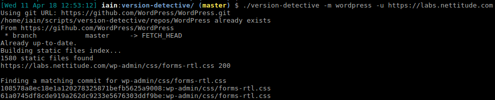
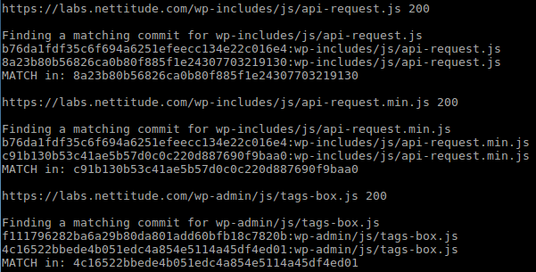
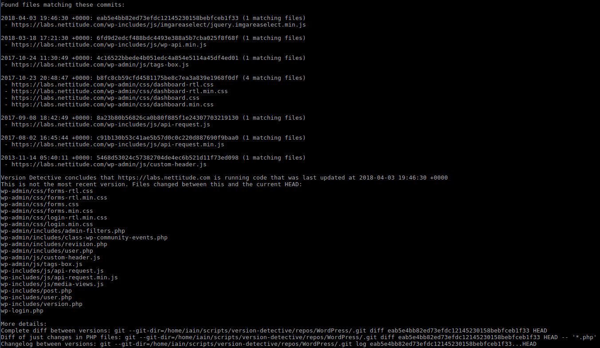

# version-detective

Use git and static files to determine a web application's middleware version.

## What

Inspired by @cornerpirate's [git-version](https://github.com/cornerpirate/git-version) tool, this automates the process of attempting to determine a site's middleware version.

## How

version-detective works out which specific commit of a known open source middleware a remote site is using. Here's how it works:

First, the middleware used by the site is cloned/updated from a git URL. This is then used to produce a list of every static file (txt, js, css etc) that was ever added or modified in all commits from that git repo.

This list of files is cycled through in reverse chronological order, issuing an HTTP HEAD request against each one to test its presence. If a file is found, its entire commit history is queried to find which commit matches exactly the observed file on the site.

This is continued until there are 10 positively identified files with a matching commit id or the list of files has run out. This is then used to show a list of likely commits for the site and make a guess at which one the site is using. This can then be used to show which files have been changed between the version currently deployed and the most up-to-date commit.

Manual analysis of code diffs, the commit log and date of commit versus public changelogs can then be used to work out what vulnerabilities might be present on the remote site.

## Why

Sometimes finding out a remote site's version number is as simple of locating the CHANGELOG.txt file, but usually site authors will delete this to hide the underlying version number. This automates a manual process that I had already tried out on a few tests.

## Requirements

 - Git command line tool
 - `pip install -r requirements.txt`

